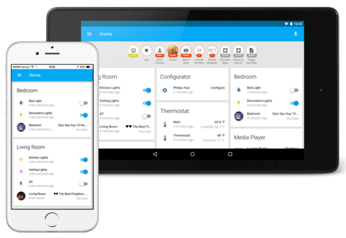
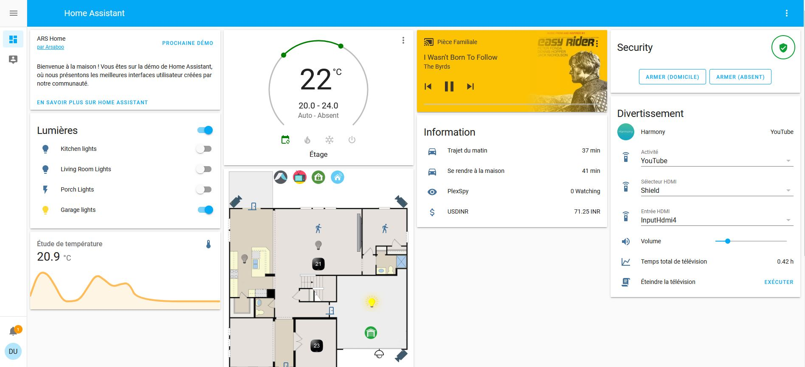
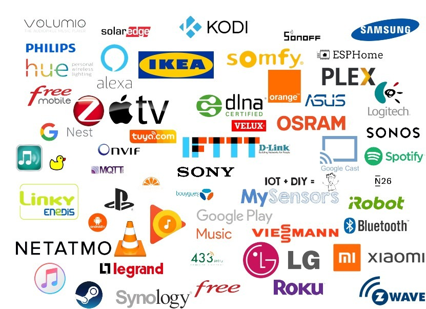

Avant de vous parler de ce merveilleux outil qu’est Home Assistant, nous voudrions d’abord vous parler de la domotique.



Ce que vous devez en retenir, c’est que pour commencer en domotique vous détenez sûrement déjà plusieurs matériels (box internet, smartphones, compteur Linky, webcams, Google Home, Alexa, Fire Stick TV, Chromecast, etc).

Sans le savoir, vous avez déjà plusieurs équipements que vous pouvez relier entre eux via une solution domotique.

## Pourquoi Home Assistant

Nous n’allons pas la comparer ici à ses concurrents, mais Home Assistant est une solution **gratuite et open source** pour la mise en place d’une solution domotique à votre domicile.

Ce système est, depuis quelques temps, devenu **accessible aux débutants** grâce aux différentes **intégrations** qui se font maintenant depuis l’**interface graphique**.

Elle bénéficie d’une **excellente communauté** à travers le **monde entier**, ce qui lui permet **d’évoluer** très **rapidement** avec des mises à jour fréquentes et régulières et l’ajout de **nombreux matériels** connus et moins connus du **grand public**. Il est tout à fait possible d’y **associer** des capteurs **DIY**.

La **sécurité** et la **confidentialité** sont des valeurs très **importantes** pour Home Assistant et c’est aussi pour cela que l’**installation** se fait **localement**.

Avec plus de 1800 intégrations possibles, **Home Assistant** est une **solution** domotique **évolutive et pérenne**.

**Avantages :**
* Simple d’installation,
* Utilisation locale possible,
* Communauté mondiale,
* Configuration d’un accès extérieur simplifié,
* Interface complètement responsive,
* Gratuité (Système, Application mobile),
* Nombreuses intégrations,
* Nombreux add-ons.

**Inconvénients :**
* Peu de sources françaises (mais nous sommes là..).



