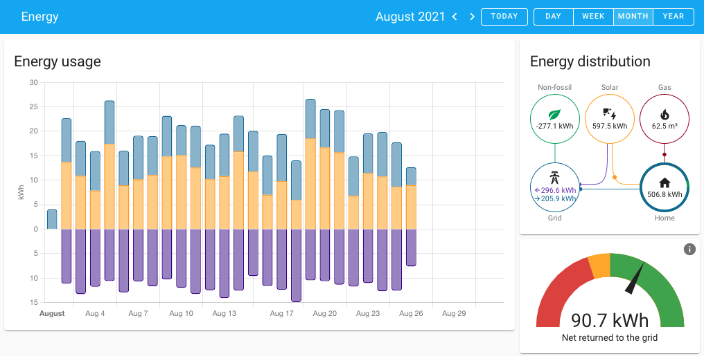
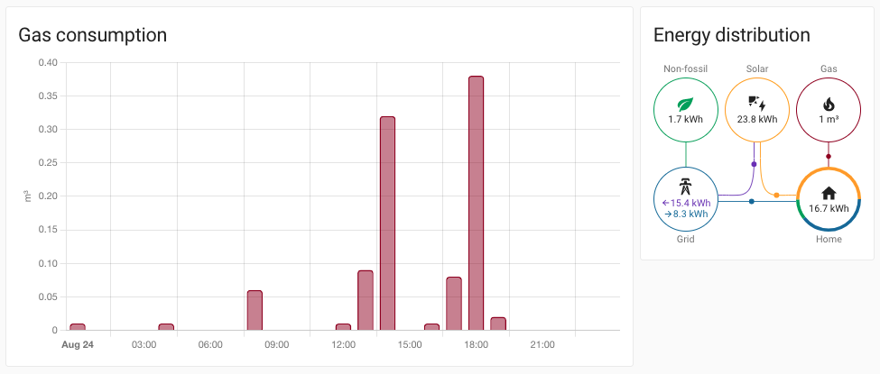
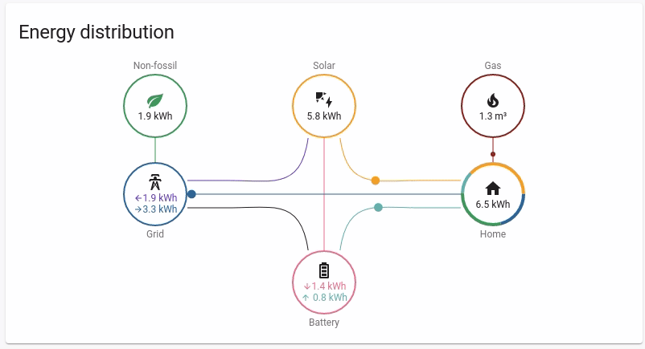
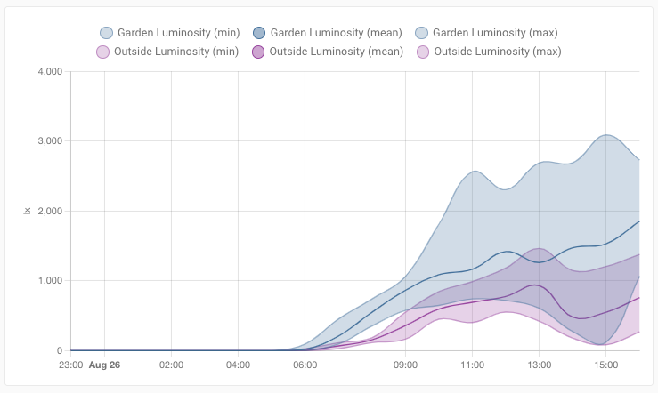
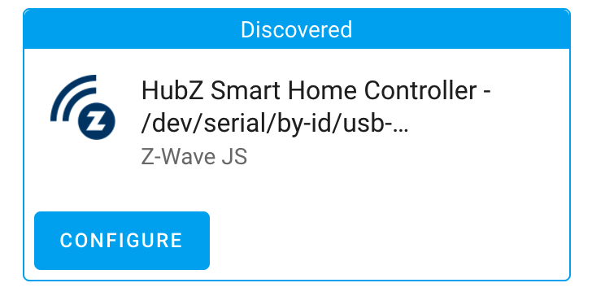

1er septembre 2021 Franck Nijhof 92 minutes de lecture

* [Coeur](https://www.home-assistant.io/blog/categories/core/)
* [Notes de version](https://www.home-assistant.io/blog/categories/release-notes/)

Lors de la dernière version, nous avons introduit la gestion de l'énergie domestique, et nous sommes très heureux de toutes les réactions et réponses que nous avons reçues ❤️ ! Dans cette version, nous avons ajouté des fonctionnalités très demandées pour la rendre encore plus utile. De plus, de nombreuses autres intégrations la prennent désormais en charge ⚡️.

Personnellement, j'aime aussi beaucoup les nouvelles statistiques à long terme et la carte de statistiques introduites dans la dernière version, et je suis vraiment heureux que dans cette version, nous puissions l'utiliser pour beaucoup plus de capteurs.

Profitez d'une autre excellente version ! Assurez-vous de vous connecter à [la 201.9 Release Party sur YouTube](https://www.youtube.com/watch?v=CxrB7DmkDJQ) plus tard dans [la journée](https://www.youtube.com/watch?v=CxrB7DmkDJQ) (21h00 CET) pour en savoir plus sur cette version !

## Accueil Mises à jour sur la gestion de l'énergie

Dernière version, nous avons [introduit les nouvelles fonctionnalités de gestion de l'énergie domestique](https://www.home-assistant.io/blog/2021/08/04/home-energy-management/) dans Home Assistant et nous sommes heureux de voir que vous l'aimez !

Nous avons vu pas mal de personnes partager leurs tableaux de bord Energy sur des réseaux sociaux comme [Facebook](https://www.facebook.com/groups/HomeAssistant) et [Twitter](https://twitter.com/home_assistant) , ce qui est vraiment génial. Partagez également une capture d'écran de votre tableau de bord et de votre histoire !

Dans cette version, l'histoire continue ! Voici ce que nous vous réservons :

### Afficher la consommation d'énergie sur une période de temps

La première itération de l'Energy Dashboard a montré un seul jour à l'époque. Super! Mais que faire si vous voulez voir comment vous avez fait cette semaine ? Ou mois ? Zut, même un an ?!

Eh bien, maintenant vous pouvez! En haut à droite du tableau de bord, vous pouvez désormais sélectionner la période de regroupement que vous souhaitez voir : Jour, Semaine, Mois ou Année.

Capture d'écran de la nouvelle sélection de périodes Energy Dashboard.

Les boutons fléchés vous permettent de parcourir ces périodes. Par exemple, lors de la sélection d'une période d'un mois à afficher, les boutons fléchés vous feront reculer/avancer d'un mois entier dans la vue.

### Suivi de votre consommation de gaz

Dans certains pays, les foyers sont raccordés au gaz. Le gaz est utilisé pour chauffer l'eau, cuisiner et chauffer la maison. Si vous avez une maison raccordée au gaz, nous avons une excellente nouvelle pour vous !

Vous l'avez peut-être déjà remarqué dans la capture d'écran précédente, à partir de cette version, nous avons ajouté la prise en charge de la surveillance de votre consommation de gaz.

Capture d'écran du nouveau Energy Dashboard surveillant la consommation de gaz.

Dans certains pays, les compteurs de gaz disposent d'un moyen standardisé de relever localement la consommation de gaz ou de fournir cette information via le compteur d'électricité. Par exemple, aux Pays-Bas, en Belgique et au Luxembourg, vous pouvez utiliser le [SlimmeLezer](https://www.zuidwijk.com/product/slimmelezer/) pour obtenir votre consommation de gaz.

### Prise en charge des batteries domestiques

Avoir des panneaux solaires est un excellent moyen de produire de l'électricité pour alimenter votre maison. Cependant, où stockez-vous l'énergie générée par vos panneaux solaires dont vous n'avez pas besoin actuellement ?

Eh bien, pour beaucoup, la solution réside dans une batterie domestique de haute capacité pour stocker l'électricité à utiliser lorsque le soleil ne peut pas la fournir (par exemple, pendant la nuit).

De nombreuses personnes ont demandé cette fonctionnalité et nous avons donc désormais ajouté la prise en charge des batteries domestiques à la gestion de l'énergie de l'assistant domestique.

Animation d'une batterie domestique dans le cadre de la distribution d'énergie.

### Ajout de la prise en charge de nombreuses autres intégrations

Lorsque vous lancez une fonctionnalité telle que la gestion de l'énergie domestique, nous comprenons que vous souhaitez l'utiliser et jouer avec elle tout de suite. Et bien que nous ayons préparé et mis à jour de nombreuses intégrations pour être prêts lors de notre premier lancement, il y en avait encore beaucoup qui avaient besoin d'une mise à jour.

En conséquence, nous avons été inondés de demandes d'ajout de support à pratiquement toutes les intégrations qui ne l'avaient pas encore… :) Beaucoup de ces demandes ont été satisfaites dans cette version.

Par exemple, l' [onduleur solaire Kostal Plenticore](https://www.home-assistant.io/integrations/kostal_plenticore) , [PVOutput](https://www.home-assistant.io/integrations/pvoutput) , [Fronius](https://www.home-assistant.io/integrations/fronius) , [SolaX Power](https://www.home-assistant.io/integrations/solax) , [Growatt](https://www.home-assistant.io/integrations/growatt_server) , [Solar-Log](https://www.home-assistant.io/integrations/solar_log) , [YouLess](https://www.home-assistant.io/integrations/youless) , [Emoncms](https://www.home-assistant.io/integrations/emoncms) , [Modbus](https://www.home-assistant.io/integrations/modbus) , et bien d'autres ont ajouté la prise en charge de toutes les [qualités](https://www.home-assistant.io/integrations/emoncms) énergétiques.

Si vous êtes un développeur d'intégration personnalisée qui souhaite ajouter un support, n'oubliez pas de consulter notre [blog de développeur](https://developers.home-assistant.io/blog/2021/08/16/state_class_total/) pour vous tenir au courant des dernières modifications.

## Statistiques à long terme débloquées pour tous les capteurs

Dans la version précédente, nous avons [introduit des statistiques](https://www.home-assistant.io/blog/2021/08/04/release-20218/#long-term-statistics) à [long terme](https://www.home-assistant.io/blog/2021/08/04/release-20218/#long-term-statistics) pour les capteurs, y compris une belle carte Lovelace qui va avec. Cependant, dans la version précédente, nous avions limité cette fonctionnalité aux capteurs liés à la température, à l'humidité, à la puissance et à l'énergie.

À partir de cette version, nous avons déclenché les statistiques à long terme pour tous les capteurs !

Capture d'écran d'un graphique statistique montrant la luminosité dans le jardin par rapport à la façade de ma maison.

Les statistiques à long terme s'appliquent à toutes les intégrations qui indiquent que leurs capteurs les prennent en charge. Heureusement, beaucoup l'ont déjà fait.

## Découverte USB

Grâce à [@bdraco](https://github.com/bdraco) , Home Assistant peut désormais découvrir les appareils USB et les intégrations qui fonctionnent avec cet appareil. Cela rend la configuration de choses comme Z-Wave ou Zigbee avec Home Assistant un jeu d'enfant maintenant !

Par exemple, si vous branchez votre nouvelle clé USB Nortek HubZ sur la machine exécutant Home Assistant, elle le découvrira et vous en informera.

Capture d'écran d'un périphérique USB découvert compatible avec Z-Wave JS.

Il suffit maintenant d'un simple clic sur le bouton « Configurer » pour configurer l'intégration de Z-Wave JS et c'est terminé ! Super sympa !

La prise en charge de la découverte USB a actuellement été ajoutée aux intégrations [Z-Wave JS](https://www.home-assistant.io/integrations/zwave_js) et [ZHA](https://www.home-assistant.io/integrations/zha) .

## Mises à jour de Z-Wave JS

Si vous êtes propriétaire d'une sirène/sonnette Z-Wave, vous savez probablement à quel point il était frustrant d'attendre que Home Assistant ajoute la prise en charge des entités pour le Sound Switch CC (classe de commande). Cela est dû à la vitesse fulgurante à laquelle le projet Z-Wave JS en amont avance ; Souvent beaucoup plus rapide que Home Assistant est capable de suivre.

Il se peut également que Home Assistant ne puisse pas (ou ne soit probablement pas) prendre en charge la classe de commande spécifique qui vous intéresse; Néanmoins, cela ne devrait pas vous empêcher de pouvoir créer des automatisations pour ces appareils !

Dans cette version, nous avons introduit le nouveau `zwave_js.value_updated` type de déclencheur d'automatisation qui vous permettra de déclencher une automatisation à partir de n'importe quelle valeur de classe de commande prise en charge par Z-Wave JS !

Afin de tirer parti de ce type de déclencheur dans l'interface utilisateur, vous devrez utiliser des [automatisations de périphérique](https://www.home-assistant.io/integrations/zwave_js#device-automations) , mais si vous écrivez vos automatisations en YAML, vous pouvez [utiliser le déclencheur directement](https://www.home-assistant.io/integrations/zwave_js#zwave_jsvalue_updated-trigger) .

Ce n'est pas tout pour l'intégration de Z-Wave JS, nous avons plus à partager !

* Vous en avez assez que votre enfant actionne cet interrupteur entièrement automatisé ? Utilisez la nouvelle `select` entité pour la classe de commande de protection pour désactiver l'accès local.
* Vous n'avez pas envie de spécifier la tonalité et le volume à chaque fois que vous activez votre sirène ? Vous avez maintenant accès au volume par défaut via une `number` entité et à la tonalité par défaut via une `select` entité.
* Nous avons rendu les `zwave_js.*` services plus flexibles : ils prennent désormais en charge les ID de zone et les `group` entités en tant qu'entrées !
* Nous avons rendu les valeurs CC de base directement contrôlables en les déplaçant de l'utilisation d' `sensor` entités pour devenir des `number` entités à la place.

## Nouvelles entités de modèle : Nombre et Sélection

Oui! Nous avons de nouvelles plates-formes que vous pouvez utiliser en utilisant l'intégration de modèles !

Grâce à [@raman325,](https://github.com/raman325) vous pouvez désormais [créer](https://github.com/raman325) vos propres modèles `select` et `number` entités ! Cela ouvre tout à fait le potentiel pour créer des interfaces utilisateur avancées :)

Comme un exemple en dit plus que mille mots, voici deux exemples qui sont tous deux basés sur une bande LED WLED. Il peut être utilisé pour extraire des caractéristiques de la bande WLED dans leurs propres entités.


# Example number entity that represents the effect speed on a WLED LED strip
# between 0 and 100%, translating it from an 0 to 255 scale.
template:
  number:
    - name: "Example number: WLED effect speed"
      state: "{{ (( state_attr("light.wled", "Speed") / 255) * 100) | round }}"
      min: 0
      max: 100
      set_value:
        service: wled.effect
        target:
          entity_id: light.wled
        data:
          speed: "{{ (255 / 100) * value }}"



# Example select entity that extracts effects from a light.
# When you change the selected option, the effect of the light changes.
template:
  select:
    - name: "Example select: WLED effect"
      state: "{{ state_attr("light.wled", "effect") }}"
      options: "{{ state_attr("light.wled", "effect_list") }}"
      select_option:
        service: light.turn_on
        target:
          entity_id: light.wled
        data:
          effect: "{{ option }}"


Oh! Et ils peuvent également être utilisés avec les nouveaux modèles de déclencheurs ! Consultez [la documentation](https://www.home-assistant.io/integrations/template) pour toutes les options disponibles.

## Nouvelles fonctions de modèle pour les zones

Deux nouvelles fonctions de modèle ont été ajoutées, ce qui facilite un peu le travail avec les zones en YAML (lors de l'utilisation de modèles).

* `area_id("value")` renvoie l'ID de zone pour une valeur donnée. Il `value` peut s'agir d'un ID de périphérique, d'un ID d'entité ou d'un nom de zone. Cette fonction peut également être utilisée comme filtre.

```
example: "{{ area_id("light.living_room_tv") }}"
example: "{{ area_id("Garden Shed") }}"
example: "{{ trigger.entity_id | area_id }}"
```

* `area_name("value")` renvoie le nom de la zone pour une valeur donnée. Il `value` peut s'agir d'un ID de périphérique, d'un ID d'entité ou d'un ID de zone. Cette fonction peut également être utilisée comme filtre.

```
service: notify.frenck
data:
  title: "Motion detected!"
  message: >-
    Motion has been detected in the {{ area_name(trigger.entity_id) }} area.
```

Merci [@raman325](https://github.com/raman325) !

## Autres changements notables

Il y a beaucoup plus de jus dans cette version ; voici quelques-uns des autres changements notables de cette version :

* [@balloob a](https://github.com/balloob) ajouté beaucoup plus de validations à l'interface utilisateur de configuration énergétique et a ajouté plus de messages d'avertissement/d'erreur. [@ludeeus les a](https://github.com/ludeeus) rendus beaux en ajoutant un nouveau style magnifique pour ce genre de messages.
* Home Assistant hors ligne et vous avez manqué de générer ses statistiques d'énergie/longues ? Plus maintenant! Home Assistant va maintenant rattraper son retard, merci [@emontnemery](https://github.com/emontnemery) !
* Grâce à [@bdraco](https://github.com/bdraco) , les images de la caméra peuvent désormais être redimensionnées à une résolution adaptée à l'appareil/écran que vous regardez ; De plus, ils ne se mettent à jour que lorsqu'ils sont visibles. Cela rend les caméras utilisables dans n'importe quelle situation de bande passante.
* L'intégration Shelly prend désormais en charge les transitions pour les lumières ! Merci [@bieniu](https://github.com/bieniu) !
* Yeelight prend désormais en charge le push local (au lieu du sondage), génial [@starkillerOG](https://github.com/starkillerOG) !
* [@emontnemery a](https://github.com/emontnemery) mis à niveau DSMR pour prendre en charge les compteurs d'énergie intelligents suédois ! Joli!
* Pour Yamaha MusicCast, [@micha91](https://github.com/micha91) a déverrouillé les fonctionnalités du navigateur multimédia !
* Le Rainforest Eagle fournira désormais des données de prix si elles sont disponibles, merci [@balloob](https://github.com/balloob) !
* [@giannello a](https://github.com/giannello) ajouté la possibilité de demander à votre Google Home où se trouve votre aspirateur :)
* Si vous utilisez la fonction de liste de courses de Home Assistant, vous pouvez désormais supprimer tous les articles terminés à la fois à l'aide d'un appel de service. Merci [@GrumpyMeow](https://github.com/GrumpyMeow) !
* [@bdraco](https://github.com/bdraco) Ajout d'une nouvelle fonctionnalité avancée pour HomeKit, permettant de transférer les événements de l'appareil vers HomeKit, déverrouillant la possibilité de déclencher des automatisations ou des scènes HomeKit.
* Grâce à [@ludeeus](https://github.com/ludeeus) , nous pouvons désormais utiliser différentes images de marque dans l'interface utilisateur lorsqu'elle est en mode sombre.
* Si vous possédez une enceinte Sonos, vous pouvez désormais modifier le niveau des graves et des aigus à l'aide d'un appel de service, merci [@Tigger2014](https://github.com/Tigger2014) !
* Les cycles de compteurs utilitaires sont désormais super flexibles avec la nouvelle option de modèles cron, sympa [@dgomes](https://github.com/dgomes) !
* Bond propose désormais de nouveaux services pour démarrer/arrêter d'augmenter/diminuer la luminosité d'une lumière. Merci [@bdraco](https://github.com/bdraco) !

## Nouvelles intégrations

Nous accueillons les nouvelles intégrations suivantes dans cette version :

* [AirTouch 4](https://www.home-assistant.io/integrations/airtouch4/) , ajouté par [@LonePurpleWolf](https://github.com/LonePurpleWolf)
* [Fjäråskupan](https://www.home-assistant.io/integrations/fjaraskupan/) , ajouté par [@elupus](https://github.com/elupus)
* [Moniteur P1](https://www.home-assistant.io/integrations/p1_monitor/) , ajouté par [@klaasnicolaas](https://github.com/klaasnicolaas)
* [IoTaWatt](https://www.home-assistant.io/integrations/iotawatt/) , ajouté par [@gtdiehl](https://github.com/gtdiehl)
* [Tractive](https://www.home-assistant.io/integrations/tractive/) , ajouté par [@zhulik](https://github.com/zhulik)
* [Découverte USB](https://www.home-assistant.io/integrations/usb/) , ajouté par [@bdraco](https://github.com/bdraco)

## Intégrations désormais disponibles pour la configuration à partir de l'interface utilisateur

Les intégrations suivantes sont désormais disponibles via l'interface utilisateur de Home Assistant :

* [Nanoleaf](https://www.home-assistant.io/integrations/nanoleaf/) , réalisé par [@milanmeu](https://github.com/milanmeu)
* [Nmap Tracker](https://www.home-assistant.io/integrations/nmap_tracker/) , réalisé par [@bdraco](https://github.com/bdraco)
* [Rainforest EAGLE-200](https://www.home-assistant.io/integrations/rainforest_eagle/) , réalisé par [@balloob](https://github.com/balloob)
* [Uptime Robot](https://www.home-assistant.io/integrations/uptimerobot/) , réalisé par [@ludeeus](https://github.com/ludeeus)


